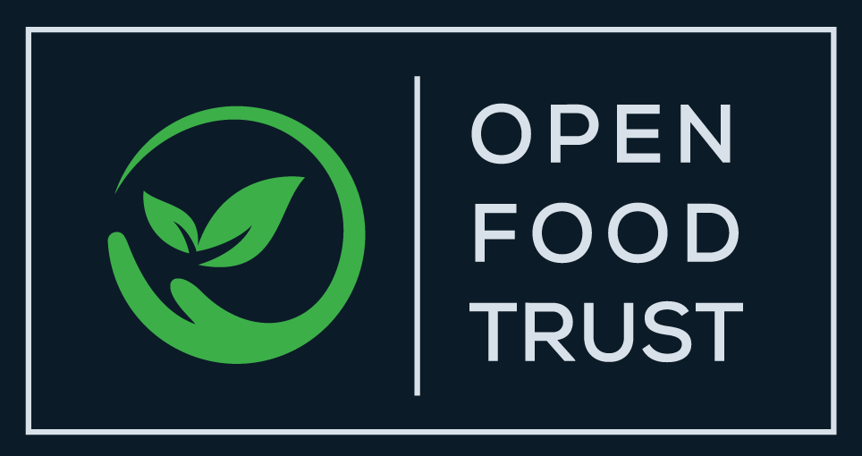
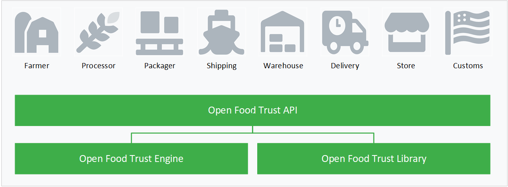

# 

Open Food Trust provides insights into the food and ag supply chain with an emphasis towards supporting initiatives around sustainability, reduction of food waste, and to enable track and trace of agricultural products in a reliable and secure manner.

The key initial use cases for this project are to shorten time to delivery and improve insights and risk around short-shelf life products as they are harvested, leave the farm (and sometimes are processed), and cross an international border.  These types of shipments typically utilize truck or air as their transport mode, but we also support key shipping use cases as well, and welcome feedback from supply chain managers on the challenges they face so that we can tune our roadmap effectively.

Key goals for this project are to improve the digitization and interoperabilty of key certificates required for cross-border ag imports/exports in a manner that is compatible with key players in the food supply chain (both public and private), and in a manner that supports broad analytics of the metadata related to these sorts of food shipments.

The Open Food Trust initiative is being sponsored by [mesur.io](https://mesur.io/) and integrates with our Earthstream:tm: platform which provides risk, spoilage, contamination, and other key models and insights that are needed by certain actors on the supply chain. 

## Project Structure
The core project is made up of three main components:
* a set of APIs that expose the ability to track and trace agricultural goods  
* the engine that actually handles requests into the APIs
* a set of libraries that provide common functionality across aspects of the engine


## Design Philosophy and Key Goals
Where possible we are using a spec first, rather than code first approach to the core APIs.  This is primarily so that we can focus on interoperability with other key vendors in the marketplace, and to identify common vocab elements that should be shared across other supply chain related efforts.

Wherever possible data/metadata is itself not stored on "the blockchain", but is instead anchored by pusing an appropriately robust hash value of key metadata to the selected blockchain.

Encryption methods in use by this project should conform to [FIPS 186-5 (DRAFT)](https://csrc.nist.gov/publications/detail/fips/186/5/draft), [FIPS 180-4](https://csrc.nist.gov/publications/detail/fips/180/4/final), and to [FIPS 197](https://csrc.nist.gov/publications/detail/fips/197/final).  This effectively means that commiters should be thinking along the lines of S?HA-256, Ed25519, and Rijndael vs other competing algorithms.

These enryption requirements effectively eliminate the large permissionless blockchains, and imply usage of [Hyperledger Fabric](https://www.hyperledger.org/use/fabric), [HashGraph](https://hedera.com/), or [QLDB](https://docs.aws.amazon.com/qldb/latest/developerguide/what-is.html).  Our prefered primary implementation at this time will be on [QLDB](https://docs.aws.amazon.com/qldb/latest/developerguide/what-is.html).  Given that a key requirement for this effort is to support cross border supply chain, and mandates interactions with governmetnal organizations, NGOs, and large enterprises, use of a permissioned blockchain should not be viewed as a detriment, but a cost of doing business.  

## Building the API Docs
**Get the reqs**
```
$ npm install -g @redocly/openapi-cli
$ npm install -g redoc-cli
# handy little quick web server if you want it
$ npm install -f http-serve
```

**Build it**
```
# This is the key build command for the API docs, a build script will be following eventually
# some preceeding code to merge up api specs, likely using speccy
$ redoc-cli bundle ./apis/oft_documents.json --output docs/index.html
# this is optional, you can also serve the generated spec directly using redoc-cli
$ http-serve ./docs
```

**View the APIs online**

Use the links below to see the existing API documentation hosted online by Mesur.io
* [Documents API](https://mesur-io.github.io/openfoodtrust/api/document_api.html)
* [Trace API](https://mesur-io.github.io/openfoodtrust/api/trace_api.html)

## Key Roadmap Items
- [X] Initial project definition and requirements gathering
- [ ] Initial API Definitions (In-progress)
    - [X] Documents 
    - [X] Trace
    - [ ] Authorization
    - [ ] Insights
- [ ] API Implementiation (In-progress)

### External and Related Miscellaneous Items

Things we like and are leveraging as a part of this project:
* [JSON-LD](https://json-ld.org/)
* [Traceability Vocab](https://github.com/w3c-ccg/traceability-vocab/)
* [Universal Wallet](https://github.com/w3c-ccg/universal-wallet-interop-spec/)
* [Sidetree](https://github.com/transmute-industries/sidetree.js)
* [QLDB](https://docs.aws.amazon.com/qldb/latest/developerguide/what-is.html)
